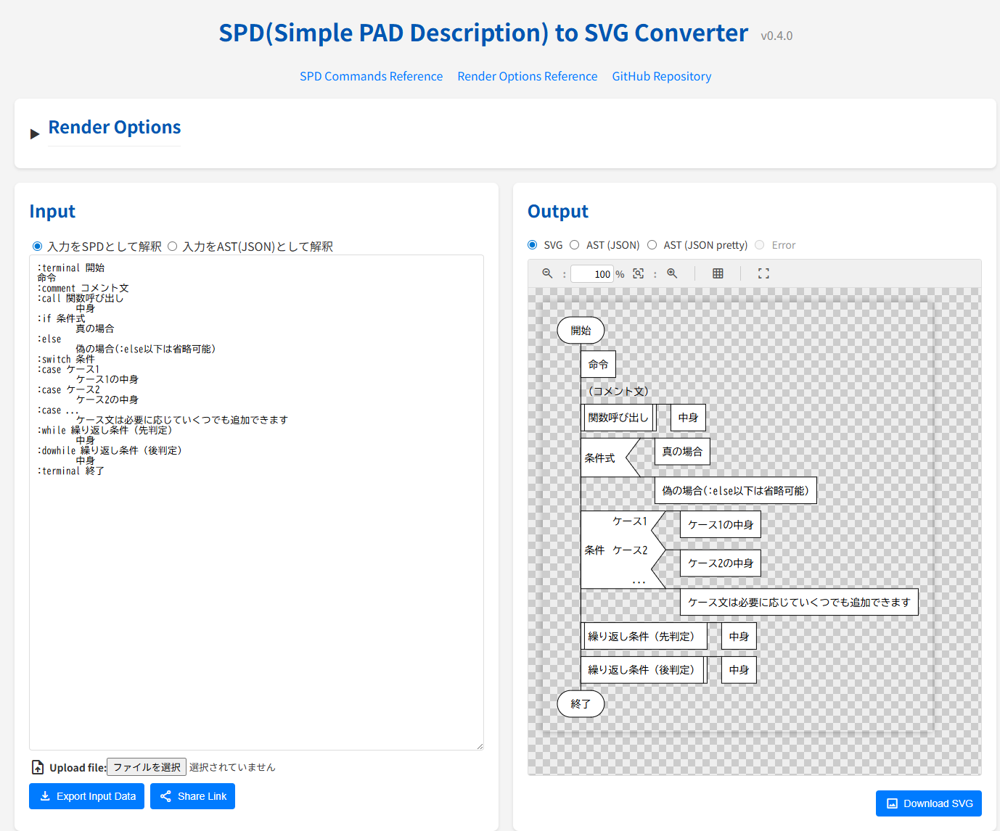

# padtools_ts

padtools_ts はPAD図を活用することを目的として作成された、PAD作成ツールです。 思考を止めず記述できることを目指しています。

---

このプロジェクトは、padtools (https://github.com/knaou/padtools) をTypeScriptで書き直したものです。

[](https://github.com/steelpipe75/padtools_ts/actions/workflows/ci.yml) [](https://codecov.io/gh/steelpipe75/padtools_ts)

## 今すぐ試す

インストール不要で、ブラウザからすぐにPAD図の作成を試すことができます。

**[Web版を開く (GitHub Pages)](https://steelpipe75.github.io/padtools_ts/)**



## インストール

### 依存関係のインストール

プロジェクトの開発に必要な依存関係をローカルにインストールするには、以下のコマンドを実行します。

```shell
npm install
```

## テスト

プロジェクトのテストを実行するには、以下のコマンドを実行します。

```shell
npm test
```

## テストカバレッジ

テストカバレッジレポートを生成するには、以下のコマンドを実行します。

```shell
npm run test:cov
```

## CLIの使用方法

`padtools_ts` は、SPDファイルをSVGに変換するCLIツールを提供します。

```shell
npx padtools_ts -i sample_input.spd -o sample_output.svg
```

また、開発時には `tsx` を使って直接ソースコードを実行することも可能です。

```shell
npm run start -- -i sample_input.spd -o sample_output.svg
```
上記の `npm run start` は、`package.json` のスクリプト定義に基づいて `tsx src/cli/cli.ts` を実行します。

### Webツールの起動

Webブラウザ上で動作するエディタを起動するには、以下のコマンドを実行します。

```shell
npm run start:web
```

このコマンドを実行すると開発用サーバーが立ち上がり、通常、`http://localhost:1234` でツールにアクセスできるようになります。

### コマンドラインオプション

`padtools_ts` は以下のオプションをサポートしています。

*   `-V, --version`: バージョン番号を出力します。
*   `-i, --input <inputFilePath>`: 入力SPDテキストファイルへのパスを指定します。
*   `-o, --output <outputFilePath>`: 出力SVGファイルへのパスを指定します。
*   `-p, --prettyprint`: 出力SVGを整形して出力します（`svgo` を使用）。
*   `--font-size <fontSize>`: SVGのフォントサイズを指定します。
*   `--font-family <fontFamily>`: SVGのフォントファミリーを指定します。
*   `--stroke-width <strokeWidth>`: SVGの線の太さを指定します。
*   `--stroke-color <strokeColor>`: SVGの線の色を指定します。
*   `--background-color <backgroundColor>`: SVGの背景色を指定します。
*   `--base-background-color <baseBackgroundColor>`: SVGのベース背景色を指定します。
*   `--text-color <textColor>`: SVGのテキスト色を指定します。
*   `--line-height <lineHeight>`: SVGの行の高さを指定します。
*   `--list-render-type <listRenderType>`: SVGのリスト描画タイプを指定します (`Original` または `TerminalOffset`)。
*   `-h, --help`: コマンドのヘルプ情報を表示します。

## REST API

`padtools_ts` は、SPDファイルをSVGに変換するREST APIを提供します。Swagger UIを使用してAPIをテストできます。

### APIサーバーの起動

APIサーバーを起動するには、以下のコマンドを実行します。

```shell
npm run start:api
```

これにより、通常、ローカルアドレス (例: `http://localhost:3000`) でサーバーが起動します。

### Swagger UI

APIのドキュメントとテストは、Swagger UIで確認できます。

- URL: `http://localhost:3000/api-docs`

### APIエンドポイント

#### GET /health

APIサーバーの稼働状況を確認します。

**レスポンス:**
```json
{
  "status": "ok"
}
```

#### POST /convert

SPDテキストをSVGに変換します。

**リクエストボディ:**
```json
{
  "spd": ":terminal Start\nprocess\n:terminal End",
  "options": {
    "fontSize": 14,
    "fontFamily": "monospace",
    "strokeWidth": 1,
    "strokeColor": "#000000",
    "backgroundColor": "#ffffff",
    "baseBackgroundColor": "none",
    "textColor": "#000000",
    "lineHeight": 1.2,
    "listRenderType": "TerminalOffset",
    "prettyprint": true
  }
}
```

**レスポンス:**
```json
{
  "svg": "<svg>...</svg>"
}
```

#### POST /convert/download

SPDテキストをSVGに変換し、ファイルとしてダウンロードします。

**リクエストボディ:**
`POST /convert` と同じです。

**レスポンス:**
SVGファイル (`image/svg+xml`) が返されます。

### オプション詳細

- `fontSize`: フォントサイズ (数値)
- `fontFamily`: フォントファミリー (文字列)
- `strokeWidth`: 線の太さ (数値)
- `strokeColor`: 線の色 (文字列)
- `backgroundColor`: 背景色 (文字列)
- `baseBackgroundColor`: ベース背景色 (文字列)
- `textColor`: テキスト色 (文字列)
- `lineHeight`: 行の高さ (数値)
- `listRenderType`: リスト描画タイプ (`Original` または `TerminalOffset`)
- `prettyprint`: SVGを整形して出力 (真偽値)

## Webツール

このプロジェクトには、Webベースのツールも含まれています。

### Webツールの実行 (開発用)

開発モードでWebツールを起動するには、以下を実行します。

```shell
npm run start:web
```

これにより、通常、ローカルアドレス (例: `http://localhost:1234`) でブラウザにツールが開きます。

### Webツールのビルド

本番用にWebツールをビルドするには、以下を実行します。

```shell
npm run build:web
```

これにより、`dist/web` ディレクトリに静的ファイルが生成されます。

### WebツールのビルドとGitHub Pagesへのデプロイ

Webツールをビルドし、GitHub Pages にデプロイするための準備を行うには、以下を実行します。

```shell
npm run build:web:gh-pages
```

このコマンドは `gh-pages` ディレクトリに静的ファイルを生成し、GitHub Pages で Jekyll プロセスが実行されないように `.nojekyll` ファイルを作成します。このコマンドの実行後、GitHub Actions のワークフローが自動的にこれらのファイルを GitHub Pages にデプロイします。

## ライセンス

[](https://opensource.org/licenses/MIT)

このプロジェクトはMITライセンスです。詳細については、[LICENSE](LICENSE)ファイルをご覧ください。

このプロジェクトでは、以下の主要なオープンソースライブラリを使用しています。

-   commander: CLIコマンドの解析に使用。[MIT License](https://github.com/tj/commander.js/blob/master/LICENSE)
-   xml-formatter: SVG出力の整形 (`--prettyprint` オプション) に使用。[MIT License](https://github.com/chrisbottin/xml-formatter/blob/master/LICENSE)
-   svgo: SVGの最適化（`--prettyprint` オプションが有効な場合）に使用。[MIT License](https://github.com/svg/svgo/blob/main/LICENSE)
-   eastasianwidth: 文字の幅計算に使用。[MIT License](https://github.com/komagata/eastasianwidth)
-   hono: REST APIサーバーの実装に使用。[MIT License](https://github.com/honojs/hono/blob/main/LICENSE)
-   @hono/node-server: Node.jsでHonoを実行するために使用。[MIT License](https://github.com/honojs/node-server/blob/main/LICENSE)
-   @hono/zod-openapi: OpenAPI仕様の生成に使用。[MIT License](https://github.com/honojs/middleware/blob/main/packages/zod-openapi/LICENSE)
-   @hono/swagger-ui: APIドキュメントのSwagger UI表示に使用。[MIT License](https://github.com/honojs/middleware/blob/main/packages/swagger-ui/LICENSE)
-   zod: スキーマバリデーションに使用。[MIT License](https://github.com/colinhacks/zod/blob/master/LICENSE)

各ライブラリのライセンス詳細については、それぞれのリンク先をご確認ください。

## リンク

- GitHub : [https://github.com/steelpipe75/padtools_ts](https://github.com/steelpipe75/padtools_ts)
- 公開サイト : [https://steelpipe75.github.io/padtools_ts/](https://steelpipe75.github.io/padtools_ts/)
